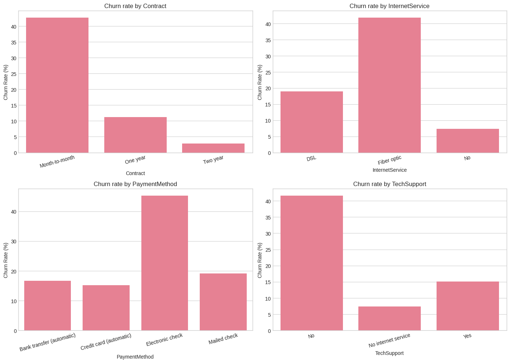

# Customer Churn Prediction — Telco Dataset

Membangun model machine learning untuk mendeteksi pelanggan yang berisiko churn, sehingga tim bisnis bisa melakukan intervensi sebelum mereka pergi.


---

## Hasil singkat

| Metrik | Nilai |
|---|---|
| Model akhir | Logistic Regression |
| ROC-AUC | 0.812 |
| Recall (churn) | **94%** pada threshold 0.14 |
| Precision (churn) | 40% |
| False negative | hanya 23 dari 374 pelanggan churn |

> Dari 374 pelanggan yang akan churn di test set, **351 berhasil dideteksi** sebelum pergi.

---

## Demo hasil


*Kiri: distribusi probabilitas prediksi model. Kanan: confusion matrix di threshold 0.14.*



*Pelanggan month-to-month churn 14x lebih tinggi dibanding kontrak two-year.*

---

## Struktur project

```
churn-prediction/
├── churn_prediction.ipynb   # Notebook utama — EDA sampai modelling
├── telco_churn.csv          # Dataset (dari Kaggle)
├── model_churn_lr.pkl       # Model yang disimpan
├── scaler_churn.pkl         # Scaler untuk preprocessing
├── model_config.json        # Konfigurasi threshold dan metadata
├── churn_by_category.png    # Visualisasi EDA
├── model_results.png        # ROC curve & feature importance
└── prob_dist_cm_tradeoff.png  # Threshold analysis
```

---

## Cara jalankan

```bash
# 1. Clone repo
git clone https://github.com/username/churn-prediction.git
cd churn-prediction

# 2. Install dependencies
pip install pandas numpy matplotlib seaborn scikit-learn imbalanced-learn joblib

# 3. Download dataset
# Cari "Telco Customer Churn" di kaggle.com, simpan sebagai telco_churn.csv

# 4. Jalankan notebook
jupyter notebook churn_prediction.ipynb
```

---

## Pendekatan & keputusan

### Masalah bisnis
Perusahaan telekomunikasi kehilangan pelanggan setiap bulan. Mengakuisisi pelanggan baru 5–7x lebih mahal dibanding mempertahankan yang sudah ada. Project ini menjawab: **pelanggan mana yang berisiko churn, dan apa yang bisa dilakukan?**

### EDA — temuan utama
Sebelum modelling, saya mengeksplorasi pola churn secara visual:

- **Kontrak month-to-month** → churn rate 43%, vs two-year hanya 3%
- **Tanpa TechSupport / OnlineSecurity** → churn rate 2x lebih tinggi
- **Tenure < 12 bulan** → periode paling kritis, churn paling banyak di tahun pertama
- **Fiber Optic** → churn lebih tinggi dari DSL, kemungkinan karena harga lebih mahal

### Preprocessing
- Konversi `TotalCharges` dari string ke numeric (ada whitespace tersembunyi)
- One-hot encoding untuk semua fitur kategorikal
- **SMOTE** untuk menangani class imbalance di training data (bukan di test data)

### Pemilihan model
Saya membandingkan dua model:

| | Logistic Regression | Random Forest |
|---|---|---|
| Recall churn | **63%** | 59% |
| ROC-AUC | 0.812 | **0.821** |
| Interpretable | Ya | Tidak |

**Dipilih: Logistic Regression** — menang di recall (yang lebih penting untuk kasus churn) dan koefisiennya bisa dijelaskan ke stakeholder non-teknis.

### Threshold analysis
Default threshold 0.50 menghasilkan recall 63%. Setelah precision-recall analysis menggunakan F2-score (recall diprioritaskan 2x), threshold optimal berada di **0.14**:

- Recall naik dari 63% → **94%**
- False negative turun dari ~138 → **23 orang**
- Trade-off: false positive 531 orang (pelanggan aman yang ikut di-flag)

**Kapan pakai threshold 0.14:**
- ✅ Intervensi murah (email, push notification)
- ✅ Biaya kehilangan pelanggan sangat tinggi
- ❌ Intervensi mahal (sales call, diskon besar) → gunakan threshold 0.30–0.35

---

## Rekomendasi bisnis

Berdasarkan temuan model, tiga program yang disarankan:

1. **Welcome program bulan 1–6** — trial layanan premium gratis untuk membangun habit dan mengurangi churn di periode paling kritis
2. **Insentif upgrade kontrak** — cashback atau bonus data untuk pelanggan month-to-month yang upgrade ke kontrak tahunan
3. **Cross-sell saat onboarding** — tawarkan TechSupport dan OnlineSecurity sejak awal; dua layanan ini terbukti berkorelasi kuat dengan retensi

---

## Keterbatasan & next step

**Keterbatasan saat ini:**
- Dataset statis — model perlu di-retrain secara berkala dengan data baru
- Probability calibration belum dilakukan; threshold rendah (0.14) mengindikasikan probabilitas model belum terkalibrasi dengan baik
- Belum ada A/B test untuk memvalidasi efektivitas intervensi secara nyata

**Yang ingin saya eksplorasi selanjutnya:**
- [ ] XGBoost + hyperparameter tuning untuk meningkatkan AUC
- [ ] SHAP values untuk explainability yang lebih dalam per pelanggan
- [ ] Probability calibration dengan Platt Scaling atau Isotonic Regression
- [ ] Deploy model sebagai REST API sederhana dengan FastAPI

---

## Tech stack

- **Data manipulation:** Pandas, NumPy
- **Visualisasi:** Matplotlib, Seaborn
- **Modelling:** Scikit-learn (Logistic Regression, Random Forest)
- **Imbalanced data:** imbalanced-learn (SMOTE)
- **Model export:** Joblib

---

## Dataset

[Telco Customer Churn](https://www.kaggle.com/datasets/blastchar/telco-customer-churn) — IBM Sample Dataset via Kaggle. 7.043 baris, 21 kolom. Lisensi: Open Database License (ODbL).

---

*Project ini dibuat sebagai bagian dari portofolio data analyst. Feedback dan pertanyaan sangat disambut — silakan buka issue atau hubungi saya di LinkedIn.*
